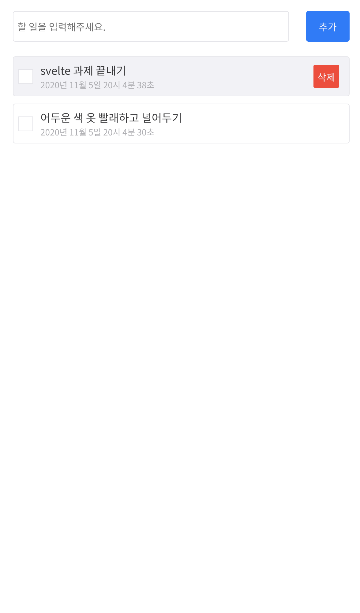
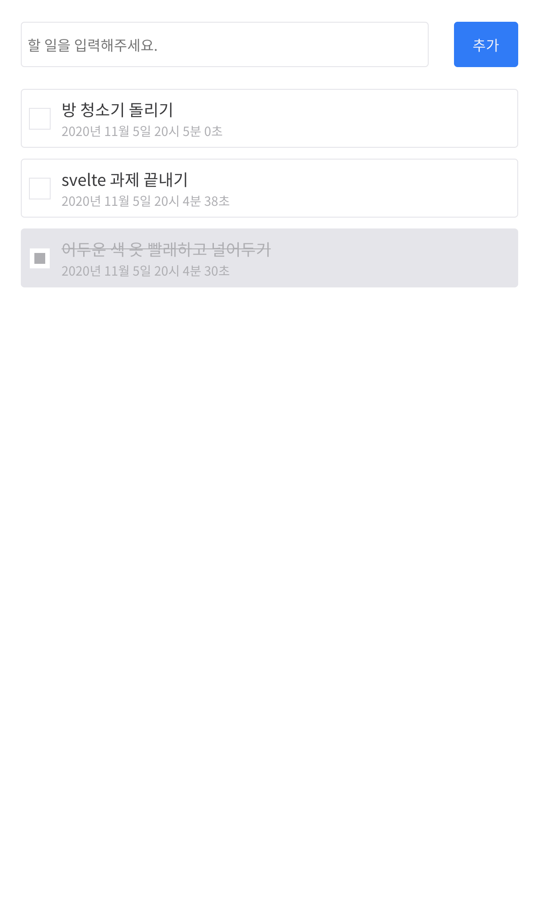

# svelte-todo example

<table>
    <tr>
        <td></td>
        <td></td>
        <td></td>
    </tr>
</table>

svelte 로 진행해보는 todo project

## 기능 체크리스트

- 할 일 추가하기
- 할 일 완료하기
- 할 일 삭제하기

## UI/UX 디테일

### input placeholder

무엇을 입력해야하는지 알게 해준다

### hover interaction

유저의 행동에 즉각적인 시각적 피드백 제공

### delete button hide

UI 상 빡센 느낌을 줄 수 있는 삭제 버튼을 숨겨두고 hover 상태일 때만 노출

### checked todo feedback

check 된 할 일에 대해서는 확실한 피드백 제공 - '배경색 변경', '텍스트 흐리게', 'text-decoration'

### no object

비어있을 수 있는(자칫 오류처럼 보일 수 있는) 화면에 대한 대비
